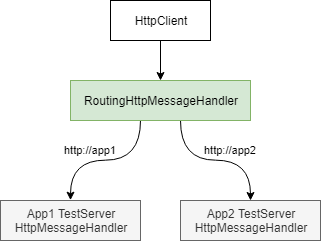
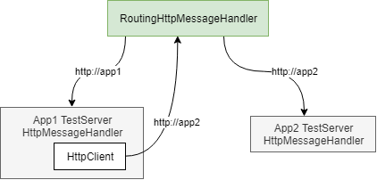
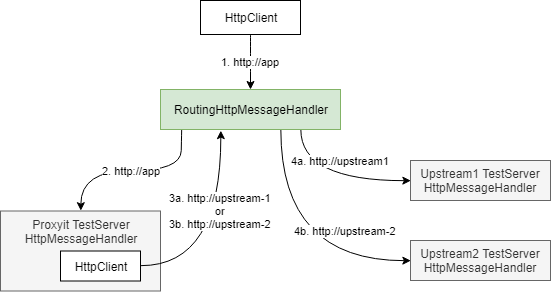

# ProxyKit HttpOverrides

[](https://actions-badge.atrox.dev/proxykit/RoutingHandler/goto)
[![NuGet][nuget badge]][nuget package]
[](https://f.feedz.io/dh/oss-ci/packages/ProxyKit.RoutingHandler/latest/download)

## Introduction

`RoutingMessageHandler` is an `HttpMessageHandler` that will route requests to
another handler based on the origin the handler is registered against. It's
primary use case is to be using in acceptance / integration testing with multiple
ASP.NET Core applications via `TestServer`.

Typical scenarios include:

- Use a single `HttpClient` in acceptance/integration tests when issuing
  requests to two or more independent applications:

  

- Providing a handler to a service that needs to make calls to one or more
  other services:

  

- Combined with ProxyKit to test the behaviour of your system with two
  instances of your application behind a reverse proxy / load balancer:

  

## Example

Install the NuGet package:

```bash
dotnet package add ProxyKit.RoutingHandler
```

This example creates two TestServer, registers them with an origin each and
shows how a request from `HttpClient` is routed to the respective `TestServer`:

```csharp
var routingHandler = new RoutingMessageHandler();

// Create the two Test Servers
var fooWebHostBuilder = WebHost.CreateDefaultBuilder<FooStartup>(Array.Empty<string>());
var fooTestServer = new TestServer(fooWebHostBuilder);

var barWebHostBuilder = WebHost.CreateDefaultBuilder<BarStartup>(Array.Empty<string>());
var barTestServer = new TestServer(barWebHostBuilder);

// Register the test servers against their respective origins
routingHandler.AddHandler("http://foo", fooTestServer.CreateHandler());
routingHandler.AddHandler("http://bar", barTestServer.CreateHandler());

// Configure your HttpClient with the routing handler
var client = new HttpClient(routingHandler);

// Requests to specific origins should be routed to the correct TestServer
var fooResponse = await client.GetAsync("http://foo");
(await fooResponse.Content.ReadAsStringAsync()).ShouldBe("foo");

var barResponse = await client.GetAsync("http://bar");
(await barResponse.Content.ReadAsStringAsync()).ShouldBe("bar");
```

## How to build

The build requires Docker to ensure portability with CI.

On Windows:

```bash
.\build.cmd
```

On Linux:

```bash
./build.sh
```

To build without docker, .NET Core SDK 3.1 is required.

On Windows:

```bash
.\build-local.cmd
```

On Linux:

```bash
./build-local.sh
```

## Contributing / Feedback / Questions

Any ideas for features, bugs or questions, please create an issue. Pull requests
gratefully accepted but please create an issue for discussion first.

I can be reached on twitter at [@randompunter](https://twitter.com/randompunter)

---

[nuget badge]: https://img.shields.io/nuget/v/ProxyKit.RoutingHandler.svg
[nuget package]: https://www.nuget.org/packages/ProxyKit.RoutingHandler
